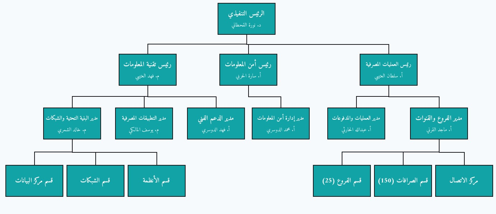
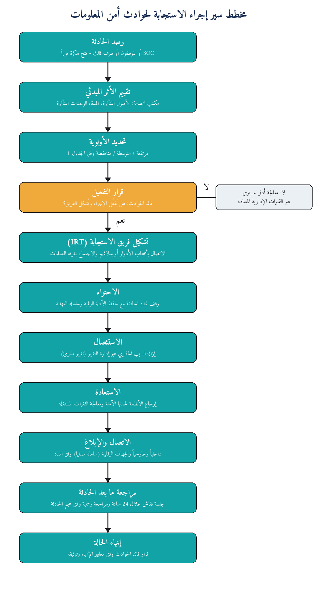

# نظام إدارة أمن المعلومات (ISMS)

<h2 dir="rtl" align="right">بنك الآفاق الرقمية | <span dir="ltr"> Digital Horizons Bank</span></h2>

<strong><span dir="ltr">Information Security Management System — ISO/IEC 27001:2022</span></strong>

<a href="https://www.iso.org/standard/27001"></a>
<a href="#محتويات-المستودع"></a>
<a href="#بيان-قابلية-التطبيق-soa"></a>
<a href="#منهجية-إدارة-المخاطر-الموحدة"></a>
<a href="#نظرة-عامة"></a>
<a href="#خريطة-الوثائق-على-دورة-pdca"></a>
<a href="#الرخصة"></a>

---

<div dir="rtl" align="right">

## نظرة عامة

يقدم هذا المستودع حزمة وثائقية متكاملة لنظام إدارة أمن المعلومات (<code dir="ltr">ISMS</code>) لمصرف رقمي افتراضي، تم إعدادها وفق متطلبات ومبادئ <strong><span dir="ltr">ISO/IEC 27001:2022</span></strong>.

تم تصميم الحزمة بحيث تمثل نظامًا متكاملًا ومترابطًا، وليس مجموعة من الملفات المستقلة؛ إذ تتشارك جميع الوثائق في:

- منهجية موحدة لإدارة المخاطر.
- نموذج حوكمة وأدوار ومسؤوليات متسق.
- خط زمني موحد.
- أرقام ومؤشرات مترابطة.
- علاقات واضحة بين الأصول والمخاطر والضوابط والسياسات والأدلة.
- دورة تحسين مستمر وفق نموذج <code dir="ltr">PDCA</code>.

تغطي الحزمة دورة نظام إدارة أمن المعلومات ابتداءً من تحديد السياق والنطاق، مرورًا بتقييم المخاطر ومعالجتها وبيان قابلية التطبيق، وانتهاءً بالتدقيق الداخلي وقياس الأداء ومراجعة الإدارة والتحسين المستمر.

### المرجعيات المستخدمة

تم بناء الحزمة بالاستناد إلى مجموعة من المرجعيات والمعايير ذات الصلة، تشمل:

- <span dir="ltr">ISO/IEC 27001:2022</span>
- <span dir="ltr">ISO/IEC 27002</span>
- تعليمات البنك المركزي السعودي (ساما)
- الضوابط الأساسية للأمن السيبراني (<span dir="ltr">NCA ECC</span>)
- نظام حماية البيانات الشخصية (<span dir="ltr">PDPL</span>)
- <span dir="ltr">PCI DSS</span> لخدمات البطاقات

</div>


<blockquote dir="rtl" align="right">
<strong>إخلاء مسؤولية:</strong> هذا المشروع أكاديمي وتعليمي بالكامل، ويعتمد على حالة دراسية افتراضية لمصرف رقمي سعودي باسم «بنك الآفاق الرقمية». لا يمثل المشروع جهة حقيقية، ولا يُعد استشارة أمنية أو قانونية أو تنظيمية. جميع الأسماء والأرقام والبيانات الواردة في الوثائق جزء من الحالة الدراسية الافتراضية.
</blockquote>

---

<div dir="rtl" align="right">

## لوحة الأرقام

<table dir="rtl">
<thead>
<tr>
<th align="right">المؤشر</th>
<th align="right">القيمة</th>
</tr>
</thead>
<tbody>
<tr><td align="right">إجمالي وثائق وسجلات الحزمة</td><td align="right"><strong>17 وثيقة</strong></td></tr>
<tr><td align="right">توزيع الوثائق</td><td align="right"><strong><span dir="ltr">12 Word + 5 Excel</span></strong></td></tr>
<tr><td align="right">ضوابط الملحق A المغطاة في <span dir="ltr">SoA</span></td><td align="right"><strong>93 ضابطًا</strong></td></tr>
<tr><td align="right">إجمالي المخاطر في سجل المخاطر</td><td align="right"><strong>32 خطرًا</strong></td></tr>
<tr><td align="right">المخاطر قبل المعالجة</td><td align="right"><strong>6 حرجة / 9 مرتفعة / 15 متوسطة / 2 منخفضة</strong></td></tr>
<tr><td align="right">المخاطر بعد المعالجة</td><td align="right"><strong>2 مرتفعة / 13 متوسطة / 17 منخفضة</strong></td></tr>
<tr><td align="right">إجمالي تكلفة خطط المعالجة</td><td align="right"><strong>21,295,000 ريال</strong></td></tr>
<tr><td align="right">متوسط إنجاز خطط المعالجة</td><td align="right"><strong>50.2%</strong></td></tr>
<tr><td align="right">مؤشرات الأداء الرئيسية</td><td align="right"><strong>22 مؤشرًا</strong></td></tr>
<tr><td align="right">حالات عدم المطابقة</td><td align="right"><strong><span dir="ltr">5 NC</span></strong></td></tr>
<tr><td align="right">فرص التحسين</td><td align="right"><strong><span dir="ltr">6 OFI</span></strong></td></tr>
<tr><td align="right">خدمات تحليل أثر الأعمال (<span dir="ltr">BIA</span>)</td><td align="right"><strong>14 خدمة</strong></td></tr>
<tr><td align="right">سيناريوهات الاستمرارية</td><td align="right"><strong>8 سيناريوهات</strong></td></tr>
<tr><td align="right">الأطراف المهتمة ومتطلباتها</td><td align="right"><strong>18 طرفًا</strong></td></tr>
</tbody>
</table>

</div>

---

<div dir="rtl" align="right">

## محتويات المستودع

</div>

```text
.
├── README.md
├── LICENSE
├── .gitignore
│
├── assets/
│   ├── org-chart.jpg
│   └── incident-response-flow.png
│
└── docs/
    ├── REQUIRED-ISMS-DOC-04-1
    │   └── السياق والمتطلبات والنطاق
    │
    ├── REQUIRED-ISMS-DOC-05-4
    │   └── سياسة أمن المعلومات v2.0 (+41 سياسة فرعية)
    │
    ├── REQUIRED-ISMS-DOC-A05-10-1
    │   └── سياسة الاستخدام المقبول
    │
    ├── REQUIRED-ISMS-DOC-A05-26-1
    │   └── إجراء الاستجابة لحوادث أمن المعلومات
    │
    ├── REQUIRED-RT 1
    │   └── منهجية تقييم ومعالجة المخاطر
    │
    ├── REQUIRED-RT 4
    │   └── بيان شهية المخاطر
    │
    ├── REQUIRED-ISMS-FORM-06-1
    │   └── سجل المخاطر
    │
    ├── REQUIRED1-ISMS-FORM-06-2
    │   └── بيان قابلية التطبيق (SoA)
    │
    ├── REQUIRED2-SA 1
    │   └── نموذج SoA فارغ معرّب وجاهز
    │
    ├── REQUIRED-ISMS-DOC-A05-9-2
    │   └── جرد أصول المعلومات
    │
    ├── REQUIRED-ISMS-DOC-06-3
    │   └── تقرير تقييم المخاطر
    │
    ├── REQUIRED-G2
    │   └── أهداف أمن المعلومات (SMART)
    │
    ├── REQUIRED-ISMS Performance Report
    │   └── تقرير الأداء و22 مؤشرًا
    │
    ├── REUIRED-M8
    │   └── إجراءات التشغيل القياسية SOP-IT-001..006
    │
    ├── REQUIRED-R9
    │   └── خط الأساس للتكوينات الآمنة
    │
    ├── REQUIRED-G12
    │   └── خطة استمرارية الأعمال والتعافي من الكوارث
    │
    └── REQUIRED2-ISMS-DOC-09-5
        └── تقرير التدقيق الداخلي
```

<div dir="rtl" align="right">

## منهجية إدارة المخاطر الموحدة

تستخدم جميع وثائق إدارة المخاطر منهجية موحدة لضمان اتساق نتائج التقييم والمعالجة والتقارير.

<table dir="rtl">
<thead>
<tr><th align="right">العنصر</th><th align="right">التعريف</th></tr>
</thead>
<tbody>
<tr><td align="right">الاحتمالية (<span dir="ltr">L</span>)</td><td align="right">مقياس من 1 إلى 5 مع وصف محدد لكل مستوى</td></tr>
<tr><td align="right">الأثر (<span dir="ltr">I</span>)</td><td align="right">مقياس من 1 إلى 5 مع وصف محدد لكل مستوى</td></tr>
<tr><td align="right">معادلة التقييم</td><td align="right"><code dir="ltr">Score = L × I</code></td></tr>
<tr><td align="right">النطاق المنخفض</td><td align="right"><span dir="ltr">1–4</span></td></tr>
<tr><td align="right">النطاق المتوسط</td><td align="right"><span dir="ltr">5–10</span></td></tr>
<tr><td align="right">النطاق المرتفع</td><td align="right"><span dir="ltr">11–15</span></td></tr>
<tr><td align="right">النطاق الحرج</td><td align="right"><span dir="ltr">16–25</span></td></tr>
<tr><td align="right">شهية المخاطر</td><td align="right">منخفضة</td></tr>
<tr><td align="right">خيارات المعالجة</td><td align="right">تخفيف، نقل، تجنب، قبول</td></tr>
</tbody>
</table>

تم تطبيق منهجية التقييم والمعالجة بشكل موحد عبر سجل المخاطر وتقارير التقييم وبيان قابلية التطبيق وتقارير الأداء والتدقيق الداخلي.

### شهية المخاطر

تعتمد الحالة الدراسية شهية مخاطر منخفضة، مع إعطاء الأولوية لتجنب المخاطر ثم تخفيضها إلى مستويات تتوافق مع حدود الشهية المعتمدة.

يتم توثيق قرار معالجة كل خطر، بما في ذلك:

- مالك الخطر.
- خيار المعالجة.
- خطة المعالجة.
- التكلفة.
- تاريخ الاستحقاق.
- حالة التنفيذ.
- المخاطر المتبقية.

</div>

---

<div dir="rtl" align="right">

## بيان قابلية التطبيق (<span dir="ltr">SoA</span>)

يغطي بيان قابلية التطبيق **93 ضابطًا** من ضوابط الملحق A في <span dir="ltr">ISO/IEC 27001:2022</span>.

<table dir="rtl">
<thead>
<tr><th align="right">حالة التطبيق</th><th align="right">العدد</th></tr>
</thead>
<tbody>
<tr><td align="right">مطبق</td><td align="right"><strong>33</strong></td></tr>
<tr><td align="right">مطبق جزئيًا</td><td align="right"><strong>51</strong></td></tr>
<tr><td align="right">قيد التنفيذ</td><td align="right"><strong>6</strong></td></tr>
<tr><td align="right">مخطط</td><td align="right"><strong>2</strong></td></tr>
<tr><td align="right">غير مطبق</td><td align="right"><strong>1</strong></td></tr>
<tr><td align="right"><strong>الإجمالي</strong></td><td align="right"><strong>93</strong></td></tr>
</tbody>
</table>

تم تحديد حالات التطبيق بناءً على سياق الحالة الدراسية والمخاطر والمتطلبات ذات الصلة، وليس من خلال افتراض التطبيق الكامل لجميع الضوابط.

### مثال على التتبع

تم تصنيف الضابط <strong><span dir="ltr">A.8.33 — Information Testing</span></strong> كغير مطبق، مع توثيق المبرر وربطه بالعناصر التالية:

- الخطر: <code dir="ltr">R-015</code>
- حالة عدم المطابقة: <code dir="ltr">NC-03</code>
- خطة المعالجة.
- تاريخ الاستحقاق: <code dir="ltr">2026-12-31</code>

ويُستخدم هذا المثال لإظهار كيفية ربط حالة الضابط بالمخاطر والإجراءات التصحيحية بدلًا من افتراض أن جميع الضوابط مطبقة بالكامل.

</div>

---

<div dir="rtl" align="right">

## خريطة الوثائق على دورة <span dir="ltr">PDCA</span>

تم توزيع وثائق الحزمة على مراحل دورة التحسين المستمر <span dir="ltr">PDCA</span> كما يلي:

<table dir="rtl">
<thead>
<tr><th align="right">المرحلة</th><th align="right">الوثائق الرئيسية</th></tr>
</thead>
<tbody>
<tr><td align="right"><strong><span dir="ltr">Plan</span></strong></td><td align="right">السياق والنطاق 04-1، منهجية المخاطر RT-1، شهية المخاطر RT-4، السياسة 05-4، الأهداف G2، جرد الأصول، سجل المخاطر، SoA، تقرير تقييم المخاطر 06-3</td></tr>
<tr><td align="right"><strong><span dir="ltr">Do</span></strong></td><td align="right">سياسة الاستخدام المقبول A05-10-1، إجراءات التشغيل M8، خط الأساس R9، خطة الاستمرارية G12، إجراء الاستجابة للحوادث A05-26-1</td></tr>
<tr><td align="right"><strong><span dir="ltr">Check</span></strong></td><td align="right">تقرير الأداء PERF-09-1، تقرير التدقيق الداخلي 09-5</td></tr>
<tr><td align="right"><strong><span dir="ltr">Act</span></strong></td><td align="right">مخرجات مراجعة الإدارة، خطط الإجراءات التصحيحية، تحسين المؤشرات، وإغلاق حالات عدم المطابقة</td></tr>
</tbody>
</table>

يساعد هذا التوزيع على توضيح العلاقة بين وثائق نظام إدارة أمن المعلومات ودورة الإدارة والتحسين المستمر.

</div>

---

<div dir="rtl" align="right">

## الحوكمة وتوزيع الأدوار

تعتمد الحالة الدراسية نموذج حوكمة يحدد المسؤوليات والصلاحيات وملاك العمليات والوثائق.

<table dir="rtl">
<thead>
<tr><th align="right">الدور</th><th align="right">المسؤولية الرئيسية</th></tr>
</thead>
<tbody>
<tr><td align="right">الإدارة العليا</td><td align="right">اعتماد السياسات والإشراف على نظام إدارة أمن المعلومات</td></tr>
<tr><td align="right">الرئيس التنفيذي (<span dir="ltr">CEO</span>)</td><td align="right">اعتماد السياسات ورئاسة مراجعة الإدارة</td></tr>
<tr><td align="right">رئيس أمن المعلومات (<span dir="ltr">CISO</span>)</td><td align="right">مالك نظام إدارة أمن المعلومات والإشراف على البرنامج الأمني</td></tr>
<tr><td align="right">رئيس تقنية المعلومات (<span dir="ltr">CIO</span>)</td><td align="right">الإشراف على الجوانب التقنية والبنية التحتية</td></tr>
<tr><td align="right">مدير أمن المعلومات</td><td align="right">قيادة عمليات الاستجابة للحوادث</td></tr>
<tr><td align="right">المراجعة الداخلية</td><td align="right">تنفيذ التدقيق الداخلي بصورة مستقلة</td></tr>
<tr><td align="right">الامتثال والخصوصية</td><td align="right">متابعة المتطلبات التنظيمية ومتطلبات الخصوصية</td></tr>
<tr><td align="right">الموارد البشرية</td><td align="right">دعم الضوابط المتعلقة بالموظفين والتوعية</td></tr>
<tr><td align="right">المشتريات</td><td align="right">إدارة متطلبات الأمن المتعلقة بالموردين</td></tr>
</tbody>
</table>

ويتم توثيق توزيع المسؤوليات من خلال جداول الاعتماد والتوزيع، ومصفوفة <span dir="ltr">RACI</span>، وأدوار فرق الاستجابة للحوادث.

</div>

---

<div dir="rtl" align="right">

## التتبع: أصل ← خطر ← معالجة ← ضابط ← سياسة ← دليل

### مثال على سلسلة التتبع

</div>

```text
Asset
│
└── AS-DB-003
    قاعدة بيانات العملاء
        │
        ▼
Risk
│
└── R-003
    ثغرات غير معالجة
        │
        ▼
Treatment
│
└── برنامج سد الثغرات
    SLA: 15 يومًا
        │
        ▼
Control
│
└── A.8.8
    إدارة الثغرات التقنية
        │
        ▼
Policy
│
└── سياسة إدارة الثغرات التقنية
        │
        ▼
Evidence
│
├── تقارير المسح
├── NC-05
└── مؤشر الثغرات في تقرير الأداء
```

<div dir="rtl" align="right">

تم توثيق سلاسل تتبع مماثلة للمخاطر الرئيسية ضمن ملفات الحزمة ذات الصلة.

</div>

---

<div dir="rtl" align="right">

## الواقعية المقصودة

تم تصميم الحالة الدراسية بحيث تعكس بيئة تشغيلية واقعية لنظام إدارة أمن المعلومات في مرحلته الأولى، ولذلك لا تفترض الحزمة أن جميع المؤشرات أو الضوابط في حالة مثالية.

تشمل الحالة الدراسية، على سبيل المثال:

- مؤشرين دون المستوى المستهدف مع وجود خطط تصحيحية.
- 51 ضابطًا في حالة تطبيق جزئي.
- مخاطر متبقية، بما في ذلك خطران مصنفان بدرجة مرتفعة.
- قرارات موثقة لقبول بعض المخاطر المتبقية.
- 5 حالات عدم مطابقة بنسب إنجاز متفاوتة تتراوح بين 30% و75%.
- 6 فرص للتحسين.
- سيناريو استمرارية واحد يكون فيه هدف <span dir="ltr">RTO</span> أعلى من <span dir="ltr">MAD</span> مؤقتًا، مع توثيق المبررات وربطه بحالة عدم المطابقة <code dir="ltr">NC-04</code>.

تهدف هذه العناصر إلى إظهار أن نظام إدارة أمن المعلومات يعتمد على دورة مستمرة من القياس والمعالجة والتحسين، وليس على افتراض الوصول إلى حالة مثالية منذ البداية.

</div>

---

<div dir="rtl" align="right">

## الخط الزمني الموحد

تم اعتماد خط زمني موحد يربط مراحل المشروع والوثائق والأنشطة الرئيسية:

<table dir="rtl">
<thead>
<tr><th align="right">التاريخ</th><th align="right">النشاط</th></tr>
</thead>
<tbody>
<tr><td align="right"><span dir="ltr">2026-01-05</span></td><td align="right">انطلاق المشروع</td></tr>
<tr><td align="right"><span dir="ltr">2026-01-22</span></td><td align="right">تحديد السياق</td></tr>
<tr><td align="right"><span dir="ltr">2026-02-01 – 2026-02-08</span></td><td align="right">إعداد منهجية المخاطر وشهية المخاطر</td></tr>
<tr><td align="right"><span dir="ltr">2026-02-15</span></td><td align="right">إصدار سياسة أمن المعلومات v2.0</td></tr>
<tr><td align="right"><span dir="ltr">2026-03-01 – 2026-03-26</span></td><td align="right">جرد الأصول وتقييم المخاطر</td></tr>
<tr><td align="right"><span dir="ltr">2026-04-02 – 2026-04-20</span></td><td align="right">إعداد الأداة وSoA وتقرير المخاطر والأهداف</td></tr>
<tr><td align="right"><span dir="ltr">2026-05-04 – 2026-05-18</span></td><td align="right">إعداد الاستجابة للحوادث والاستمرارية</td></tr>
<tr><td align="right"><span dir="ltr">2026-06-01 – 2026-06-15</span></td><td align="right">إعداد SOP وخط الأساس</td></tr>
<tr><td align="right"><span dir="ltr">2026-06-18 – 2026-07-22</span></td><td align="right">تنفيذ تمريني استعادة وفدية مكتبية</td></tr>
<tr><td align="right"><span dir="ltr">2026-08-16 – 2026-09-01</span></td><td align="right">تنفيذ التدقيق الداخلي وإعداد التقرير</td></tr>
<tr><td align="right"><span dir="ltr">2026-09-07 – 2026-09-12</span></td><td align="right">إعداد تقرير الأداء ومراجعة الإدارة والتسليم</td></tr>
<tr><td align="right"><span dir="ltr">2026-11-19</span></td><td align="right">اختبار تعافٍ كامل</td></tr>
<tr><td align="right"><span dir="ltr">2027-03-01</span></td><td align="right">المراجعة السنوية</td></tr>
</tbody>
</table>

</div>

---

<div dir="rtl" align="right">

## ضبط الجودة وسلامة الملفات

تم تنفيذ مراجعة جودة شاملة على الحزمة لضمان الاتساق وسلامة الملفات.

### سلامة المحتوى

تم إجراء التعديلات على محتوى القوالب مع الحفاظ على العناصر الأساسية، بما في ذلك:

- التصميم والتنسيق.
- المعادلات.
- الجداول المحورية.
- المخططات.
- قوائم التحقق.
- التنسيق الشرطي.

### التحقق الآلي

شملت عملية التحقق:

- التحقق من عدم وجود نصوص إنجليزية متبقية في المواضع التي يفترض أن تكون عربية.
- التحقق من عدم وجود عناصر نائبة مثل:
  - <code dir="ltr">[Company Name]</code>
  - <code dir="ltr">TBD</code>
  - <code dir="ltr">Select…</code>
- التحقق من عدم وجود بقايا غير معالجة من القوالب الأصلية.

### التحقق من بنية الملفات

تم فحص بنية الحزمة باستخدام عدة آليات للتحقق، شملت:

- مدقق داخلي.
- Apache POI.
- فتح الملفات فعليًا باستخدام المكتبات البرمجية المناسبة.

### الأصول المرئية

تتضمن الحزمة رسومًا وصورًا عربية تم إعدادها بما يتوافق مع محتوى الحالة الدراسية، ومن أبرزها:

- الهيكل التنظيمي.
- مخطط سير الاستجابة للحوادث.

</div>

---

<div dir="rtl" align="right">

## كيفية استخدام الحزمة

للاستفادة من الوثائق بالترتيب المقترح:

1. نزّل المستودع وافتح مجلد <code dir="ltr">docs/</code>.
2. افتح الملفات باستخدام Microsoft Office 2016 أو إصدار أحدث.
3. في حال فتح أحد الملفات في وضع الحماية، اختر <strong><span dir="ltr">Enable Editing</span></strong> عند الحاجة.
4. بالنسبة إلى ملفات Excel، انتظر حتى يتم تحديث المعادلات والجداول المحورية عند الفتح.
5. يوصى بالبدء بالوثائق بالترتيب التالي:

</div>

```text
01. REQUIRED-ISMS-DOC-04-1
    السياق والنطاق

02. REQUIRED-ISMS-DOC-05-4
    سياسة أمن المعلومات

03. REQUIRED-ISMS-FORM-06-1
    سجل المخاطر

04. REQUIRED1-ISMS-FORM-06-2
    بيان قابلية التطبيق (SoA)

05. REQUIRED-ISMS-DOC-06-3
    تقرير تقييم المخاطر

06. REQUIRED-ISMS Performance Report
    تقرير الأداء

07. REQUIRED2-ISMS-DOC-09-5
    تقرير التدقيق الداخلي
```

---

<div dir="rtl" align="right">

## المعاينات البصرية

### الهيكل التنظيمي للبنك

</div>

<p dir="rtl" align="right">

</p>

<div dir="rtl" align="right">

### مخطط سير الاستجابة للحوادث

</div>

<p dir="rtl" align="right">

</p>

---

<div dir="rtl" align="right">

## الرخصة

هذا المشروع مرخص بموجب:

<strong><span dir="ltr">Creative Commons Attribution-NonCommercial 4.0 International (CC BY-NC 4.0)</span></strong>

يسمح الترخيص بمشاركة العمل والاقتباس منه مع ضرورة نسب العمل إلى صاحبه، مع منع الاستخدام التجاري.

للاطلاع على التفاصيل الكاملة، راجع ملف <a href="LICENSE" dir="ltr">LICENSE</a>.

</div>

---

<div dir="ltr" align="left">

## English Summary

A complete and internally consistent <strong>Arabic Information Security Management System (ISMS) documentation package</strong> developed for a fictional Saudi digital bank, based on <strong>ISO/IEC 27001:2022</strong>.

The package contains <strong>17 Word and Excel artifacts</strong> covering the complete ISMS lifecycle, including:

- Organizational context and ISMS scope.
- Information security policies.
- Risk assessment and treatment methodology.
- A live risk register containing 32 risks.
- A complete Statement of Applicability covering 93 Annex A controls.
- Information asset inventory.
- SMART information security objectives.
- Standard Operating Procedures (SOPs).
- Secure configuration baselines.
- Incident response procedures.
- Business continuity and disaster recovery planning.
- Business Impact Analysis (BIA) with RTO/RPO objectives.
- Internal audit reporting.
- Performance monitoring with 22 KPIs.
- Nonconformities and opportunities for improvement.
- Management review and corrective actions.

The documentation package follows a unified governance model, timeline, risk methodology, and traceability framework:

</div>

```text
Asset
  ↓
Risk
  ↓
Treatment
  ↓
Control
  ↓
Policy
  ↓
Evidence
```

<div dir="ltr" align="left">

The project is structured around the <strong>PDCA continuous improvement cycle</strong> and intentionally reflects a realistic first-year ISMS implementation, including partially implemented controls, residual risks, corrective actions, and improvement opportunities.

The project is developed strictly as an <strong>academic and educational case study</strong> based on a fictional Saudi digital bank. It does not represent a real financial institution and should not be considered professional security, legal, regulatory, or compliance advice.

The project is licensed under <strong>CC BY-NC 4.0</strong>.

</div>

---

<div dir="ltr" align="center">

<strong>Digital Horizons Bank — Information Security Management System</strong>

<br>

Academic Information Security Project

</div>
